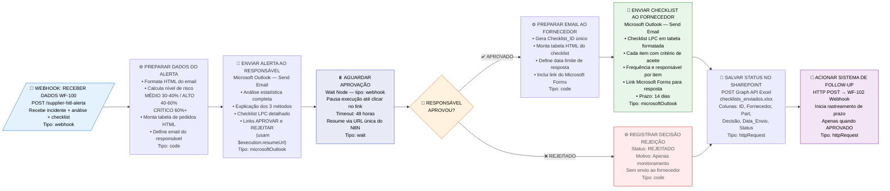
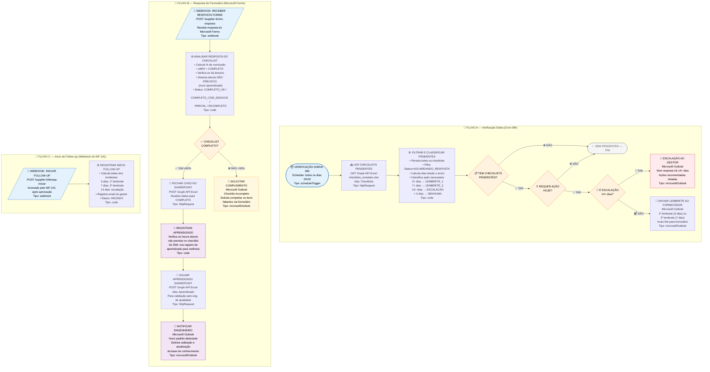
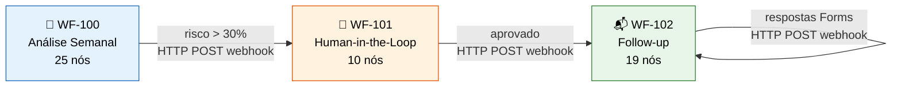

# Diagrama de Fluxo — Sistema de Prevenção de Incidentes de Fornecedores

> Visualização completa dos 3 workflows N8N com todos os nós e conexões.

---

## WF-100 | ANÁLISE SEMANAL AUTOMÁTICA

```mermaid
flowchart TD
    A1(["🕐 TRIGGER SEMANAL\nSchedule: toda segunda-feira 08h\nTipo: scheduleTrigger"])

    A2["📥 BAIXAR INCIDENTES EXCEL\nGET Graph API → SharePoint\nArquivo: incidentes_fornecedores.xlsx\nTipo: httpRequest"]

    A3["📊 PARSEAR INCIDENTES\nConverte binário Excel → linhas JSON\nAba: Incidentes\nTipo: spreadsheetFile"]

    A4["📥 BAIXAR PROCESSADOS\nGET Graph API → aba Processados\nRetorna IDs já analisados\nTipo: httpRequest"]

    A5["⚙️ PARSEAR PROCESSADOS\nConverte resposta Graph API\npara itens N8N\nTipo: code"]

    A6["🔍 FILTRAR NOVOS INCIDENTES\nCompara todos os IDs com processados\nRetorna apenas incidentes NOVOS\nTipo: code"]

    A7{"❓ EXISTEM NOVOS\nINCIDENTES?"}

    A8(["✅ SEM NOVOS — FIM\nNenhum incidente novo esta semana\nTipo: noOp"])

    A9["📥 BAIXAR TABELA DE FAMÍLIAS\nGET Graph API → aba Familias\nMapeamento: Part_Number → Familia\nTipo: httpRequest"]

    A10["⚙️ PARSEAR FAMÍLIAS\nConverte para mapa\nPart_Number : Familia\nTipo: code"]

    A11["📥 BAIXAR PEDIDOS FUTUROS\nGET Graph API → SharePoint\nArquivo: planejamento_pedidos.xlsx\nTipo: httpRequest"]

    A12["⚙️ PARSEAR PEDIDOS\nConverte para itens N8N\nTodos os pedidos abertos\nTipo: code"]

    A13["🔄 PROCESSAR POR INCIDENTE\nSplit In Batches — 1 por vez\nCria loop por incidente\nTipo: splitInBatches"]

    A14["⚙️ ENRIQUECER CONTEXTO\n• Mapeia família do part number\n• Busca histórico do fornecedor\n• Filtra pedidos próximos 90 dias\n• Detecta ocorrência nova/inédita\n• Monta prompts para classificação 14Q\nTipo: code"]

    A15["⚙️ PREPARAR REQUEST 14Q\nMonta body JSON para OpenAI\nPreserva TODOS os dados do incidente\nno mesmo item (_openai_body_14q)\nTipo: code"]

    A16["🤖 CLASSIFICAR 14Q via GPT-4\nPOST https://api.openai.com/v1/chat/completions\nModel: gpt-4 | Temp: 0.1\nResposta: JSON com categoria 14Q\nTipo: httpRequest"]

    A17["⚙️ EXTRAIR 14Q + PREPARAR LPC\n• Parseia resposta do GPT-4\n• Extrai: categoria, confiança, justificativa\n• Monta prompt do checklist LPC\n• Prepara próxima chamada OpenAI\nTipo: code"]

    A18["🤖 GERAR CHECKLIST LPC via GPT-4\nPOST https://api.openai.com/v1/chat/completions\nModel: gpt-4 | Temp: 0.2\nResposta: JSON com checklist detalhado\nTipo: httpRequest"]

    A19["📐 EXTRAIR LPC + CALCULAR TUDO\n━━━━━━━━━━━━━━━━━━━━━━━━━━━━━━━━━\n• Extrai checklist da resposta da IA\n━━━━━━━━━━━━━━━━━━━━━━━━━━━━━━━━━\nMÉTODO 1 — PPM (Peso 30%):\nPPM = falhas ÷ entregas × 1.000.000\n━━━━━━━━━━━━━━━━━━━━━━━━━━━━━━━━━\nMÉTODO 2 — Tendência Temporal (Peso 40%):\nMédia móvel: meses 1-3 vs meses 4-6\nCrescente / Estável / Decrescente\n━━━━━━━━━━━━━━━━━━━━━━━━━━━━━━━━━\nMÉTODO 3 — Probabilidade Bayesiana (Peso 30%):\nP = (falhas_tipo+1) ÷ (total+2)\n━━━━━━━━━━━━━━━━━━━━━━━━━━━━━━━━━\nPROBABILIDADE FINAL:\nP = PPM×0,30 + Tend×0,40 + Bayes×0,30\n━━━━━━━━━━━━━━━━━━━━━━━━━━━━━━━━━\nCRUZAMENTO PEDIDOS:\nMês 1: P × 1,00 | Mês 2: P × 0,85\nMês 3: P × 0,70\n━━━━━━━━━━━━━━━━━━━━━━━━━━━━━━━━━\nGera explicação detalhada dos cálculos\nTipo: code"]

    A20{"⚖️ PROBABILIDADE FINAL\n> 30% ?"}

    A21["🚨 ACIONAR ALERTA HITL\nHTTP POST → WF-101 Webhook\nEnvia todos os dados do incidente\n+ análise estatística + checklist\nTipo: httpRequest"]

    A22(["📋 REGISTRAR MONITORAMENTO\nSem envio ao fornecedor\nStatus: MONITORAMENTO\nTipo: noOp"])

    A23["💾 SALVAR ANÁLISE NO SHAREPOINT\nPOST Graph API Excel\nInsere linha na aba Análises\ncom todos os cálculos detalhados\nTipo: httpRequest"]

    A24["✅ MARCAR COMO PROCESSADO\nPOST Graph API Excel\nInsere ID na aba Processados\nEvita reprocessamento futuro\nTipo: httpRequest"]

    A25(["✅ ANÁLISE SEMANAL COMPLETA\nTodos os incidentes foram processados\nTipo: noOp"])

    A1 --> A2 --> A3 --> A4 --> A5 --> A6 --> A7
    A7 -->|"❌ NÃO"| A8
    A7 -->|"✅ SIM"| A9
    A9 --> A10 --> A11 --> A12 --> A13
    A13 -->|"📦 batch item"| A14
    A13 -->|"✅ done"| A25
    A14 --> A15 --> A16 --> A17 --> A18 --> A19 --> A20
    A20 -->|"🔴 RISCO ALTO"| A21
    A20 -->|"🟢 DENTRO LIMITE"| A22
    A21 --> A23
    A22 --> A23
    A23 --> A24
    A24 -->|"🔄 loop back"| A13

    style A1 fill:#e3f2fd,stroke:#1565c0,color:#000
    style A7 fill:#fff3e0,stroke:#e65100,color:#000
    style A8 fill:#f5f5f5,stroke:#9e9e9e,color:#555
    style A13 fill:#f3e5f5,stroke:#7b1fa2,color:#000
    style A16 fill:#e8f5e9,stroke:#2e7d32,color:#000
    style A18 fill:#e8f5e9,stroke:#2e7d32,color:#000
    style A19 fill:#e3f2fd,stroke:#1565c0,color:#000
    style A20 fill:#ffebee,stroke:#c62828,color:#000
    style A21 fill:#ffebee,stroke:#c62828,color:#000
    style A22 fill:#f5f5f5,stroke:#9e9e9e,color:#555
    style A25 fill:#e8f5e9,stroke:#2e7d32,color:#000
```

---

## WF-101 | ALERTA HUMANO (HUMAN-IN-THE-LOOP)

---

## WF-102 | SISTEMA DE FOLLOW-UP E APRENDIZADO

---

## Legenda de Cores

| Cor | Significado |
|-----|-------------|
| 🔵 Azul | Trigger / Webhook (início do fluxo) |
| 🟠 Laranja | Nó de decisão (IF) |
| 🟢 Verde | Chamadas à IA (OpenAI GPT-4) / Conclusão OK |
| 🟣 Roxo | Loop / Aprendizado |
| 🔴 Vermelho | Alertas de risco / Escalação |
| ⚪ Cinza | Fim sem ação |

## Fluxo entre os 3 Workflows

